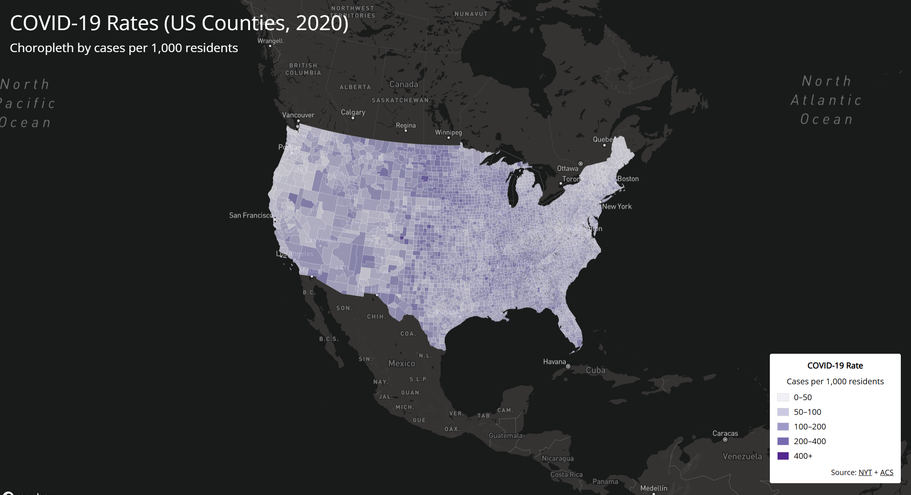
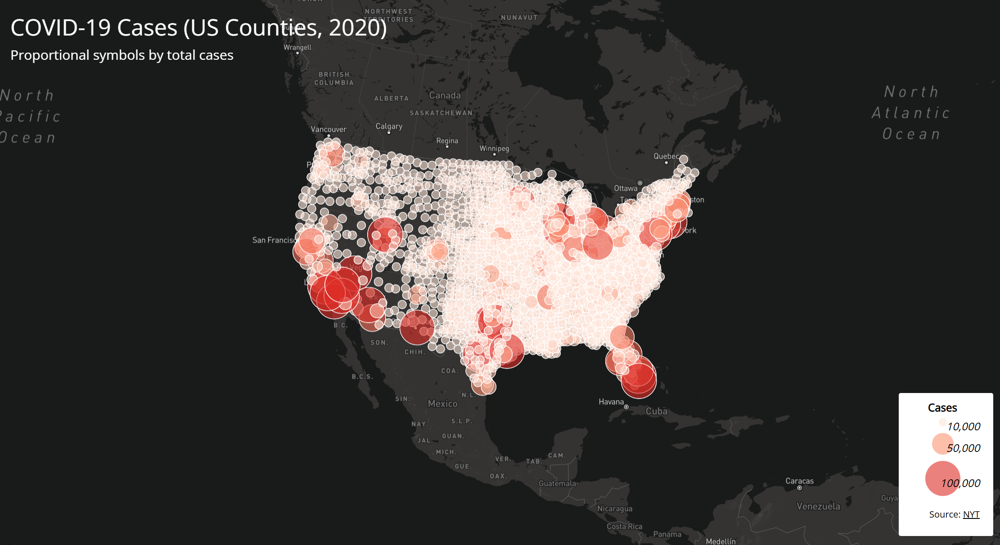

# COVID USA Maps (2020)

This project contains two interactive web maps created with Mapbox using county-level COVID-19 data for the United States (2020). The goal is to compare spatial patterns using two different thematic mapping approaches: a choropleth map of case rates and a proportional symbol map of total cases.

## Live Maps (GitHub Pages)
- Map 1 (Rates): https://naamaal12.github.io/Covid_USA_maps/map1.html
- Map 2 (Cases): https://naamaal12.github.io/Covid_USA_maps/map2.html

## Screenshots

## Map 1: COVID-19 Rates (Choropleth)
- Theme: cases per 1,000 residents by county
- Projection: Albers (Mapbox display projection)
- Interaction: click a county to view county/state, rates, cases, and deaths
- Legend: class breaks showing rate ranges

## Map 2: COVID-19 Cases (Proportional Symbols)
- Theme: total cases by county using proportional circle sizes
- Projection: Albers (Mapbox display projection)
- Interaction: click a circle to view county/state, cases, and deaths
- Legend: proportional circle sizes for case thresholds

## Primary Functions Added Beyond Lecture Basics
- Popups on click for both thematic layers
- Proportional symbol legend built with HTML/CSS

## Libraries Used
- Mapbox
- Google Fonts (Open Sans)

## Data
- COVID-19 county data: The New York Times COVID-19 dataset (county totals)
- Population/rates: ACS (used to calculate cases per 1,000 residents)

## Data Processing
- Converted county shapefiles to GeoJSON
- Simplified geometry and removed unused attributes using Mapshaper

## Acknowledgements
- Base map tiles and rendering: Mapbox
- COVID-19 data: New York Times
- Population/rate source: ACS
- Course materials and guidance: GEOG 458 (UW)
